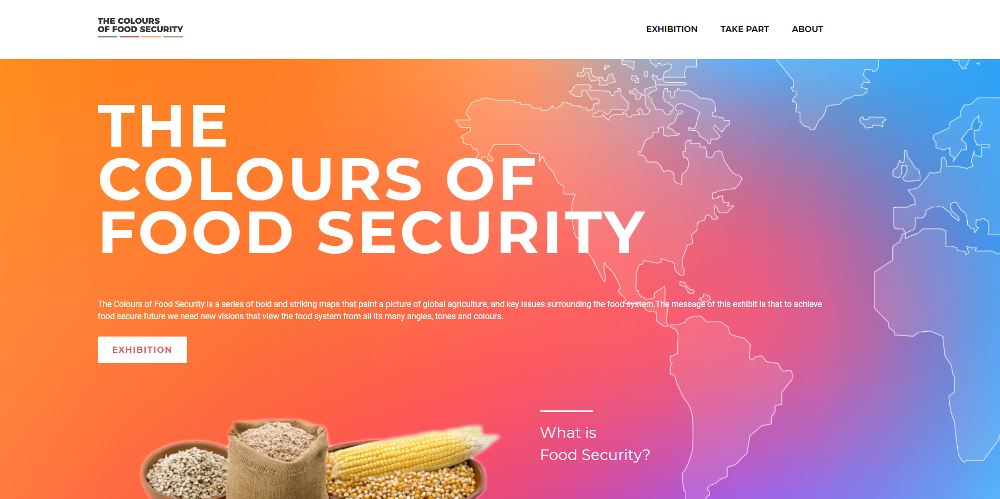

# Colours of Food Security

This is a project for LUGE Research Group at the University of British Columbia.
It contains custom WordPress template and a plugin for custom post types. 

Capstone client project for RED Academy Web Development course 2018.

## Authors
* [Lucas Da Cunha](https://github.com/Lcunha25)
* [Tony Tran](https://github.com/codeMrRobot)
* [Katerina Vopalkova](https://github.com/kachniss)

## Based on
* [RED Starter Theme](https://github.com/redacademy/redstarter) (forked from Underscores)

## Technologies used
* Gulp
* Sass
* jQuery
* WordPress 
    * Custom Templates
    * Custom Post Types

## License
This project is licensed under the ISC license.